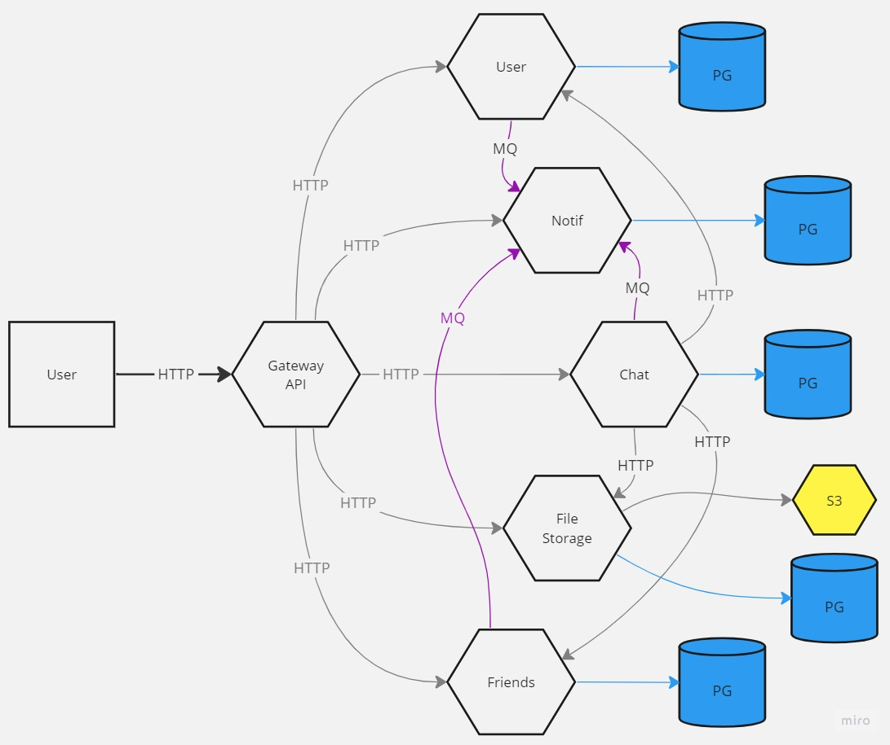

# Messenger application
Приложение разрабатывается в ходе учебного курса по Java Spring Boot. 
Задача в том, чтобы разработать сервис по спецификации, ознакомиться с ней можете [здесь](TaskDescription/README.md)

## Requirements

* Docker и docker compose
* JDK 11

### Как запустить

* В корне проекта разверните 3 контейнера командой <code>docker compose up</code> или <code>docker-compose up</code> для более ранних версий docker-compose
* Сконфигурируйте среду в IDE под проект
* Запустите проект в IDE как отдельные сервисы с помощью инструмента Services в тулбаре. Можно сбилдить в jar файлы самостоятельно, но я такой цели не преследовал, тут уж сами

### Тестирование

Теперь можно потестить запросы. По умолчанию все сервисы, которые я создавал, находятся на портах 8010-8015, 
перейдя по пути [localhost:8010](http://localhost:8010) вы попадете на Gateway. 
В дальнейшем планируется вывести общую Swagger-документацию именно сюда, собрав её из других сервисов с помощью swagger-aggregator модуля
Но сейчас это не приоритетная задача. 

По пути localhost:*порт_приложения*/swagger-ui/index.html можно перейти в спецификацию конкретного сервиса. 
В каждом сервисе используется авторизация по JWT токену, токен можно получить в UserService, зарегистрировав пользователя.

### Примерная схема работы сервиса

